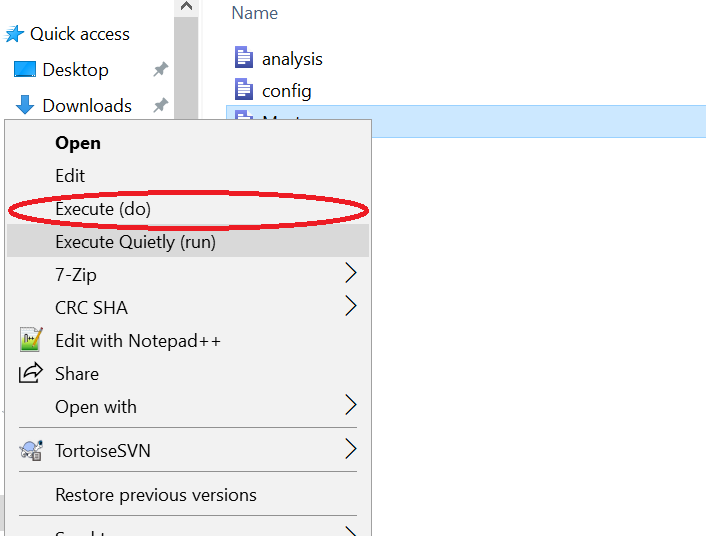

(hands-off-running)=
# Hands-off running: Creating a controller script

Let's ramp it up a bit. Your code must run, beginning to end, top to bottom, without error, and without any user intervention. This should in principle (re)create all figures, tables, and numbers you include in your paper. 

Seem trivial? Out of 8280 replication packages in ~20 top econ journals, only 2594 (31.33%) had a main/controller script [^2]. 


[^2]: Results computed on Nov 26, 2023 based on a scan of replication packages conducted by Sebastian Kranz. 2023. “Economic Articles with Data”. https://ejd.econ.mathematik.uni-ulm.de/, searching for the words main, master, makefile, dockerfile, apptainer, singularity in any of the program files in those replication packages. Code not yet integrated into this presentation.


```{warning}
We have seen users who appear to highlight code and to run it interactively, in pieces, using the program file as a kind of notepad. This is not reproducible, and should be avoided. It is fine for debugging.
```

## TL;DR

- Create a "main" file that runs all the other files in the correct order.
- Run this file, without user intervention.
- It should run without error.

## Creating a main or master script

In order to be able to enable "hands-off running", the main script is key. I will show here a few simple examples for single-software replication packages. We will discuss more complex examples in one of the next chapters.

### Single-software main scripts

::::{tab-set}


:::{tab-item} Stata

```stata
* main.do
* This is a simple example of a main file in Stata
* It runs all the other files in the correct order

* Set the root directory

global rootdir : pwd

* Call the various files that consitute your complete analysis.
* Run the data preparation file
do $rootdir/01_data_prep.do

* Run the analysis file
do $rootdir/02_analysis.do

* Run the table file
do $rootdir/03_tables.do

* Run the figure file
do $rootdir/04_figures.do

* Run the appendix file
do $rootdir/05_appendix.do
```
The use of `do` (instead of `run` or even `capture run`) is best, as it will show the code that is being run, and is thus more transparent to you and the future replicator.

Run this using the [right-click method](https://labordynamicsinstitute.github.io/ldilab-manual/96-02-running-stata-code.html#step-6-run-the-code) (Windows) or from the terminal (macOS, Linux): 

```bash
cd /where/my/code/is
stata-mp -b do main.do
```
where `stata-mp` should be replaced with `stata` or `stata-se` depending on your licensed version.



:::

:::{tab-item} R

```r
# main.R
# This is a simple example of a main file in R
# It runs all the other files in the correct order

# Set the root directory (using here() or rprojroot()).
# rootdir <- getwd()
# or if you are using Rproj files or git
rootdir <- here::here()

# Call each of the component programs, using source().
# Run the data preparation file
source(file.path(rootdir, "01_data_prep.R"), echo = TRUE)

# Run the analysis file
source(file.path(rootdir, "02_analysis.R"), echo = TRUE)

# Run the table file
source(file.path(rootdir, "03_tables.R"), echo = TRUE)

# Run the figure file
source(file.path(rootdir, "04_figures.R"), echo = TRUE)

# Run the appendix file
source(file.path(rootdir, "05_appendix.R"), echo = TRUE)
```
The use of `echo=TRUE` is best, as it will show the code that is being run, and is thus more transparent to you and the future replicator.


Even if you are using Rstudio, run this using the [terminal method](https://labordynamicsinstitute.github.io/ldilab-manual/96-12-running-r-code.html) in Rstudio for any platform, or from the terminal (macOS, Linux): 

```bash
cd /where/my/code/is
R CMD BATCH main.R
```

Do not use `Rscript`, as it will not generate enough output! On Windows, under `cmd.exe` or Powershell, you may need to adjust `R` to be `R.exe` if it is in your `%PATH%` or the full path to `R.exe` if it is not (this is automatically set for you in Rstudio).

:::

:::{tab-item} Python

```python
# main.py
# This is a simple example of a main file in Python
# It runs all the other files in the correct order

# Set the root directory
# rootdir = os.getcwd()
# or better
rootdir = os.path.dirname(os.path.realpath(__file__))

# Run the data preparation file
exec(open(os.path.join(rootdir, "01_data_prep.py")).read())

# Run the analysis file
exec(open(os.path.join(rootdir, "02_analysis.py")).read())

# Run the table file
exec(open(os.path.join(rootdir, "03_tables.py")).read())

# Run the figure file
exec(open(os.path.join(rootdir, "04_figures.py")).read())

# Run the appendix file
exec(open(os.path.join(rootdir, "05_appendix.py")).read())
```

Run this from your favorite IDE or from a terminal:

```bash
cd /where/my/code/is
python main.py
```

:::

:::{tab-item} MATLAB

```matlab
% main.m
% This is a simple example of a main file in MATLAB
% It runs all the other files in the correct order

% Set the root directory
rootdir = pwd;

% Run the data preparation file
run(fullfile(rootdir, '01_data_prep.m'))

% Run the analysis file
run(fullfile(rootdir, '02_analysis.m'))

% Run the table file
run(fullfile(rootdir, '03_tables.m'))

% Run the figure file
run(fullfile(rootdir, '04_figures.m'))

% Run the appendix file
run(fullfile(rootdir, '05_appendix.m'))
```

Run this script, and it should run all the other ones. Note that there are various other ways to achieve a similar goal, for instance, by treating each MATLAB file as a function. 

:::

:::{tab-item} Julia

In Julia, we can do something similar:

```julia
# This is a simple example of a main file in Julia
# It runs all the other files in the correct order

# Set the root directory
rootdir = pwd()

# Run the data preparation file
include(joinpath(rootdir, "01_data_prep.jl"))

# Run the analysis file
include(joinpath(rootdir, "02_analysis.jl"))

# Run the table file
include(joinpath(rootdir, "03_tables.jl"))

# Run the figure file
include(joinpath(rootdir, "04_figures.jl"))

# Run the appendix file
include(joinpath(rootdir, "05_appendix.jl"))
```

Run this from your favorite IDE or from a terminal:

```bash
cd /where/my/code/is
julia main.jl
```

:::

::::

### Multi-software main scripts

When your project uses multiple software packages, in order to have a main controller script, you need to choose one language "to rule them all". Often, this takes the form of a shell script, or sometimes a Python script, useful for its cross-platform nature. That being said, in calling out to other software, a necessary level of OS-dependency is introduced, and this should be generalized by defining the OS-specific paths early in the script, so others can adapt accordingly. From there, it usually isn't much more complicated than running single-software main scripts. The sections here provide some examples for OS-level scripting languages; see [a later section](multi-software-projects) for how to call software A (say, Stata) from within software B (say, R).

:::: {tab-set}

:::{tab-item} Bash

Bash is a cross-platform terminal interpreter that many users may have encountered if using Git on Windows ("Git Bash"). It is also installed by default on macOS and Linux. It can be used to run command line versions of most statistical software, and is thus a good candidate for a main script. Note that it does introduce an additional dependency - the replicator now needs to have Bash installed, and it is not entirely platform agnostic when calling other software, as those calls may be different on different platforms, though that is a problem afflicting any multi-software main script. In particular, on most Windows machines, the statistical software is not in the `%PATH%` by default, and thus may need to be called with the full path to the executable.

We will discuss software search paths more fully in the [section on environments](environments).


```bash
# main.bash
# This is a simple example of a main file in Python
# It runs all the other files in the correct order

# Set the root directory
rootdir=$(pwd)
# equivalent:
# rootdir=$PWD 
cd "$rootdir"

# Define binary locations
statabin="stata-mp"        # or full path to Stata executable
pythonbin="python3.12"     # or full path to Python executable
Rbin="R"                   # or full path to R executable
matlabbin="/opt/local/matlab" # or full path to MATLAB executable

# For macOS, you might use:
# statabin="stata-mp"        # or "stata" or "stata-se" depending on your license
# pythonbin="python3"        # or "python3.x" if you have multiple versions
# Rbin="R"                   # R is usually in the PATH on macOS
# matlabbin="/Applications/MATLAB_R2023a.app/bin/matlab" # adjust version as needed

# For Windows, you might need to specify full paths, e.g.:
# statabin="/c/Program Files/Stata17/StataMP-64.exe"
# pythonbin="/c/Users/YourUser/anaconda3/python.exe"
# Rbin="/c/Program Files/R/R-4.3.0/bin/R.exe
# matlabbin="/c/Program Files/MATLAB/R2023a/bin/matlab.exe"

# Run the data preparation file
"$statabin" -b do "01_data_prep.do"

# Run the analysis file
"$pythonbin" "02_analysis.py"

# Run the table file
"$Rbin" CMD BATCH "03_tables.R"

# Run the figure file
"$Rbin" CMD BATCH "04_figures.R"

# Run the appendix file
# Linux/macOS
"$matlabbin" -nodisplay -r "addpath(genpath('.')); 05_appendix"
# Windows:
# "$matlabbin" -nosplash -minimize -r "addpath(genpath('.')); 05_appendix"
#start matlab -nosplash  -minimize -r  "addpath(genpath('.')); 05_appendix"
```

:::

:::{tab-item} Python

Python is often used as a general purpose coordinator. This can range from simple listings to complex workflow management systems ([Scons](https://scons.org/), [Snakemake](https://snakemake.github.io/), and others. Here, we show a simple example using the `subprocess` module to call command line versions of other software. 

```python
# main.py
# This is a simple example of a main file in Python
```python
# It runs all the other files in the correct order
import os
import subprocess

# Set the root directory
rootdir = os.path.dirname(os.path.realpath(__file__))
os.chdir(rootdir)

# Define binary locations
statabin = r"C:\Program Files\Stata17\StataMP-64.exe"
# Specify the full path to your Python executable if needed
pythonbin = r"C:\Users\YourUser\anaconda3\python.exe"
# Specify the full path to your R executable if needed
Rbin = r"C:\Program Files\R\R-4.3.0\bin\R.exe"
# Specify the full path to your MATLAB executable below
matlabbin = r"C:\Program Files\MATLAB\R2023a\bin\matlab.exe"

# Run the data preparation file
subprocess.run([statabin, "-b", "do", os.path.join(rootdir, "01_data_prep.do")])
# Run the analysis file
subprocess.run([pythonbin, os.path.join(rootdir, "02_analysis.py")])
# Run the table file
subprocess.run([Rbin, "CMD", "BATCH", os.path.join(rootdir, "03_tables.R")])
# Run the figure file
subprocess.run([Rbin, "CMD", "BATCH", os.path.join(rootdir, "04_figures.R")])
# Run the appendix file
subprocess.run([
  matlabbin,
  "-nodisplay",
  "-r",
  f"addpath(genpath('{rootdir}')); 05_appendix"
])
```
:::


:::{tab-item} PowerShell

PowerShell is a Windows-native terminal interpreter that can also be installed on macOS and Linux (though that is rarely done). It can be used to run command line versions of most statistical software, and is thus a good candidate for a main script. On most Windows machines, the statistical software is not in the `%PATH%` by default, and thus may need to be called with the full path to the executable.

````powershell
# main.ps1
# This is a simple example of a main file in PowerShell
# It runs all the other files in the correct order
# Set the root directory
$rootdir = Get-Location
# Change to that directory
Set-Location $rootdir

# Example for calling Stata
# Specify the full path to your Stata executable below
$stataPath = "C:\Program Files\Stata17\StataMP-64.exe"
# Specify the full path to your Python executable if needed
$pythonPath = "C:\Users\YourUser\anaconda3\python.exe"
# Specify the full path to your R executable if needed
$RPath = "C:\Program Files\R\R-4.3.0\bin\R.exe"
# Specify the full path to your MATLAB executable below
$matlabPath = "C:\Program Files\MATLAB\R2023a\bin\matlab.exe"

# Run the data preparation file
& $stataPath -b do "$rootdir\01_data_prep.do"

# Run the analysis file
& $pythonPath "$rootdir\02_analysis.py"

# Run the table file
& $RPath CMD BATCH "$rootdir\03_tables.R"

# Run the figure file
& $RPath CMD BATCH "$rootdir\04_figures.R"

# Run the appendix file
Start-Process -NoNewWindow -FilePath $matlabPath -ArgumentList "-nosplash", "-minimize", "-r", "addpath(genpath('$rootdir')); 05_appendix"
```

:::


:::{tab-item} Makefile

Makefiles are a more complex way of achieving the same goal. They have the advantage that they will only rerun code that needs to be rerun, based on file modification times. This is particularly useful if some parts of your code take a long time to run, and you want to avoid rerunning them if not necessary. However, they are more complex to set up, and require some familiarity with the Makefile syntax. 

```makefile
# Makefile
# This is a simple example of a Makefile
# It runs all the other files in the correct order
# Set the root directory
ROOTDIR := $(shell pwd)
# Run the data preparation file
data_prep:
  stata-mp -b do $(ROOTDIR)/01_data_prep.do
# Run the analysis file. Depends on data prep being done first
analysis: data_prep
  python $(ROOTDIR)/02_analysis.py
# Run the table file. Depends on analysis being done first
tables: analysis
  R CMD BATCH $(ROOTDIR)/03_tables.R
# Run the figure file. Also depends on analysis being done first
figures: analysis
  R CMD BATCH $(ROOTDIR)/04_figures.R
# Run the appendix file. If it doesn't depend on anything else, it can be run independently
appendix: 
  matlab -nodisplay -r "addpath(genpath('$(ROOTDIR)')); 05_appendix"
# Default target: run them all
all: data_prep analysis tables figures appendix
```

:::


::::

## Takeaways

- [x] your code runs without problem, after all the debugging.
- [x] your code runs without manual intervention, and with low effort
- [ ] it actually produces all the outputs
- [ ] your code generates a log file that you can inspect, and that you could share with others.
- [ ] it will run on somebody else’s computer
