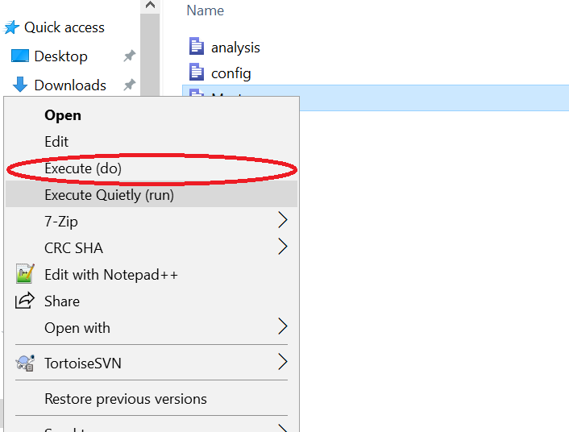

# Hands-off running: Creating a controller script

Did it take you a long time to run everything again?


# Let's ramp it up a bit. 

Your code must run, beginning to end, top to bottom, without error, and without any user intervention. This should in principle (re)create all figures, tables, and numbers you include in your paper. 


::: {.notes}
We have seen users who appear to highlight code and to run it interactively, in pieces, using the program file as a kind of notepad. This is not reproducible, and should be avoided. It is fine for debugging.
:::

## TL;DR

- Create a "main" file that runs all the other files in the correct order.
- Run this file, without user intervention.
- It should run without error.

## Creating a main or master script

In order to be able to enable "hands-off running", the main script is key. I will show here a few simple examples for single-software replication packages. We will discuss more complex examples in one of the next chapters.

## Examples


## Stata {auto-animate=true}

::::{.columns}

:::{.column width=40%}

Set the root directory (dynamically)

:::

:::{.column width=60%}

```{.stata code-line-numbers="1-2"}
* main.do
global rootdir : pwd
* Run the data preparation file
do $rootdir/01_data_prep.do
* Run the analysis file
do $rootdir/02_analysis.do
* Run the table file
do $rootdir/03_tables.do
* Run the figure file
do $rootdir/04_figures.do
* Run the appendix file
do $rootdir/05_appendix.do
```

:::
::::

## Stata {auto-animate=true}

::::{.columns}

:::{.column width=40%}

Call the various files that consitute your complete analysis.

:::

:::{.column width=60%}

```{.stata code-line-numbers="4,6,8,10,12"}
* main.do
global rootdir : pwd
* Run the data preparation file
do $rootdir/01_data_prep.do
* Run the analysis file
do $rootdir/02_analysis.do
* Run the table file
do $rootdir/03_tables.do
* Run the figure file
do $rootdir/04_figures.do
* Run the appendix file
do $rootdir/05_appendix.do
```

:::
::::


## Notes

- The use of `do` (instead of `run` or even `capture run`) is best, as it will show the code that is being run, and is thus more transparent to you and the future replicator.

## Notes

- Run this using the [right-click method](https://labordynamicsinstitute.github.io/ldilab-manual/96-02-running-stata-code.html#step-6-run-the-code) (Windows) or from the terminal (macOS, Linux): 

:::: {.columns}

::: {.column width=60%}



:::

::: {.column width=40%}

```bash
cd /where/my/code/is
stata-mp -b do main.do
```
where `stata-mp` should be replaced with `stata` or `stata-se` depending on your licensed version.

:::
::::


## R {auto-animate=true}


:::: {.columns}

::: {.column width=40%}

Set the root directory (using `here()` or `rprojroot()`).

:::

::: {.column width=60%}

```{.r code-line-numbers="3-4"}
# main.R
## Set the root directory
# If you are using Rproj files or git
rootdir <- here::here()
# or if not
# rootdir <- getwd()
## Run the data preparation file
source(file.path(rootdir, "01_data_prep.R"), 
       echo = TRUE)
## Run the analysis file
source(file.path(rootdir, "02_analysis.R"), 
       echo = TRUE)
## Run the table file
source(file.path(rootdir, "03_tables.R"), echo = TRUE)
## Run the figure file
source(file.path(rootdir, "04_figures.R"), echo = TRUE)
## Run the appendix file
source(file.path(rootdir, "05_appendix.R"), echo = TRUE)
```

:::
::::


## R {auto-animate=true}


:::: {.columns}

::: {.column width=40%}

Call each of the component programs, using `source()`.

:::

::: {.column width=60%}


```{.r code-line-numbers="8-9|11-12|14|16|18"}
# main.R
## Set the root directory
# If you are using Rproj files or git
rootdir <- here::here()
# or if not
# rootdir <- getwd()
## Run the data preparation file
source(file.path(rootdir, "01_data_prep.R"), 
       echo = TRUE)
## Run the analysis file
source(file.path(rootdir, "02_analysis.R"), 
       echo = TRUE)
## Run the table file
source(file.path(rootdir, "03_tables.R"), echo = TRUE)
## Run the figure file
source(file.path(rootdir, "04_figures.R"), echo = TRUE)
## Run the appendix file
source(file.path(rootdir, "05_appendix.R"), echo = TRUE)
```

:::
::::

## Notes for R {auto-animate=true}

The use of `echo=TRUE` is best, as it will show the code that is being run, and is thus more transparent to you and the future replicator.

## Notes for R {auto-animate=true}

Even if you are using Rstudio, run this using the [terminal method](https://labordynamicsinstitute.github.io/ldilab-manual/96-12-running-r-code.html) in Rstudio for any platform, or from the terminal (macOS, Linux): 

```bash
cd /where/my/code/is
R CMD BATCH main.R
```

Do not use `Rscript`, as it will not generate enough output! 

## Other examples

For examples for **Julia, Python, MATLAB,** and **multi-software scripts**, see the [full text](https://larsvilhuber.github.io/self-checking-reproducibility/02-hands_off_running.html).

## Takeaways


- ✅ your code runs without problem, after all the debugging.
- ✅your code runs without manual intervention, and with low effort
- ❓it actually produces all the outputs
- ❓your code generates a log file that you can inspect, and that you could share with others.
- ❓it will run on somebody else's computer


